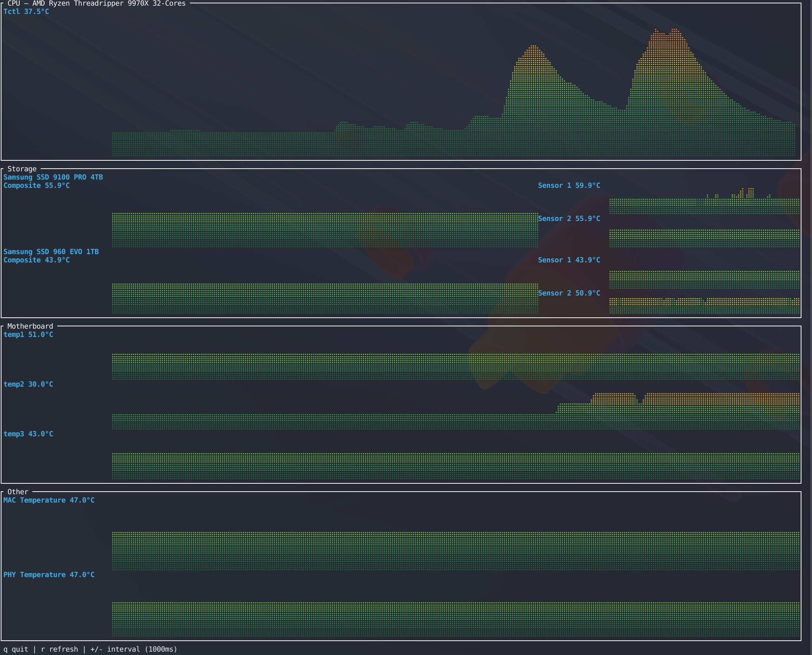

# btemp

Terminal UI for live **temperature** graphs from **lm-sensors**, in the spirit of [btop](https://github.com/aristocratos/btop): color-coded **braille** line charts that update as your hardware changes.

**Repository:** [github.com/bverkley/btemp](https://github.com/bverkley/btemp)

## Screenshot



Additional examples can be added under [`screenshots/`](screenshots/).

## Requirements

- Linux
- [`lm-sensors`](https://github.com/lm-sensors/lm-sensors) installed and configured so the `sensors` command works (JSON preferred: `sensors -j`)

## Setup (typical)

1. Install the package for your distro (often named `lm-sensors` or `sys-apps/lm-sensors`).
2. Probe chips (once, as root): `sudo sensors-detect` and accept the defaults you are comfortable with.
3. Load any suggested kernel modules, then run `sensors` and confirm you see temperatures.

## Build

```bash
cargo build --release
```

Binary: `target/release/btemp`

## Run

```bash
./target/release/btemp
```

- `q` quit  
- `r` refresh now  
- `+` / `-` adjust poll interval (250 ms–10 s)

If `sensors` is missing or returns no data, btemp shows a short message pointing you at lm-sensors setup.

## How it works

btemp prefers `sensors -j` and falls back to plain `sensors` text. Readings are grouped into panels (CPU with composite + per-core style rows, storage/NVMe, GPU, motherboard, other) using adapter and label heuristics.

**Storage (wide terminal, ≥44 cols):** sensors are grouped **by drive (chip)**. Each drive shows the **model name once** as a header (from `/sys/class/nvme/*/model` when PCI matches the chip id). Under that: a **tall composite** braille chart on the left (`Composite` sensor when present), and **auxiliary** sensors (`Sensor 2`, etc.) stacked on the right with matching total height. Narrow terminals fall back to a flat list.

**Graphs:** temperature history uses ratatui **Canvas** + **Braille**: the chart sweeps many vertical samples (interpolated between history points) so the trace reads as **solid** columns. Like **btop**, the **fill** is colored by **height in the chart** (cool greens at the bottom of the trace, warmer tones toward the top), not a single color from the instantaneous temperature. Graph rows **expand vertically** within each panel. The **horizontal axis is a fixed sample window** (same size as the history buffer): traces are **right-aligned**, so with few samples the **left side stays empty** and the wave **grows toward the left** as the buffer fills, then **scrolls** like btop instead of compressing all points to full width.

**CPU:** the CPU panel title includes the **`model name`** line from **`/proc/cpuinfo`** when readable. Individual rows still show sensor labels (e.g. Tctl).

**Storage columns:** under each drive, the composite chart uses **67%** of the width and auxiliary sensors **33%** (explicit percentage split).

**Temperature scale:** the Y axis is in **°C** from your data range; the **braille colors** are a **vertical heat ramp** (position in the graph), similar to btop. Values show as **`°C`** (Unicode degree sign).

## Privacy and data

btemp is **local-only**: it runs the `sensors` command, reads **`/proc/cpuinfo`** (for the CPU panel title), and reads **sysfs** under `/sys/class/nvme` (to match NVMe model names to sensor chips). It does **not** open network connections, send telemetry, or log your readings to disk. Anything on screen is already available to other local processes with similar permissions.

Screenshots or screen shares of the TUI can expose hardware model names and temperatures; treat them like any other system monitor.

## Contributing

Issues and pull requests are welcome.

## Credits

- **Idea and direction:** Brian Verkley
- **Code:** Built with [Cursor](https://cursor.com)

## License

MIT (see `LICENSE-MIT`).
